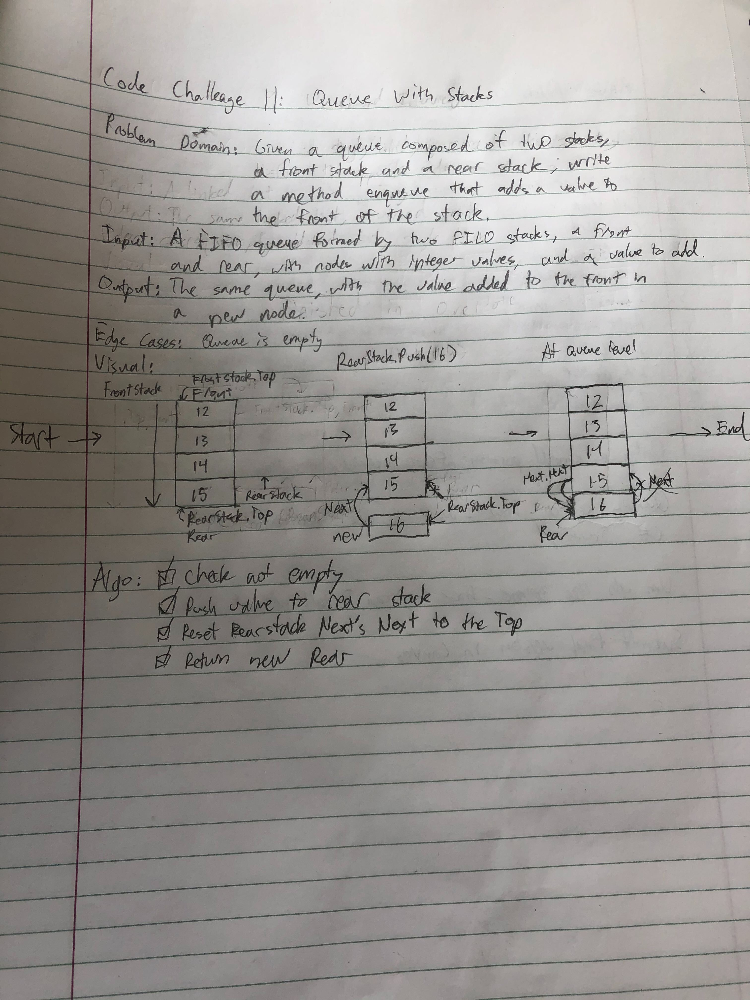
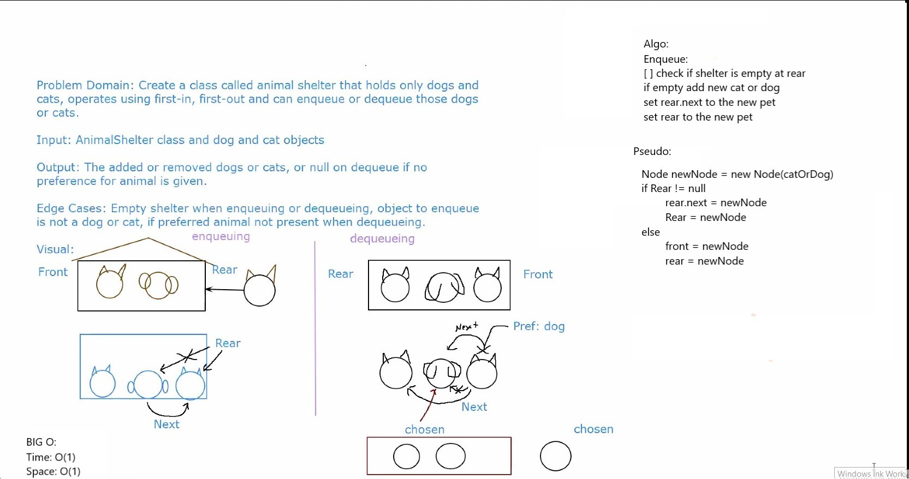

# data-structures-and-algorithms

## Table of Contents

### Challenges
- Class 01 - Array Reverse
- Class 02 - Array Shift
- Class 03 - Array Binary Search
- Class 11 - Queue with Stacks
- Class 12 - FIFO Animal Shelter
- Class 13 - Multi-Bracket Validation
- Class 16 - FizzBuzzTree
- Class 26 - Insertion Sort
- Class 27 - Merge Sort
- Class 28 - Quick Sort
- Class 31 - Repeated Word
- Class 32 - Tree Intersection
- Class 33 - Left Join

## 401 Code Challenges - Found in challenges directory

### Code Challenge Class 01: Array Reverse
- Write a function called reverseArray which takes an array as an argument. Without utilizing any of the built-in methods available to your language, return an array with elements in reversed order.

#### Approach and Efficiency
- This code uses a for loop to iterate over the new array, and set its index values in ascending order. It sets these values equal to the input array's index values in descending order.
- The big O is O(n) time

#### Solution

### Code Challenge Class 02: Array Shift
- Write a function called insertShiftArray which takes in an array and the value to be added. Without utilizing any of the built-in methods available to your language, return an array with the new value added at the middle index.

#### Approach and Efficiency
- This code creates a new array with a length one longer than the current array. It then finds the value of the middle index of the new array based on its length. The method then loops over the new array, and for indexes less than the middle index, enters the values at those indexes from the current array. At the middle index, it enters the new value. At indexes greater than the middle index, it enters the values from the current array at the new array index - 1.
- The big O is O(n) time

#### Solution

### Code Challenge Class 03: Array Binary Search
- Write a function called BinarySearch which takes in 2 parameters: a sorted array and the search key. Without utilizing any of the built-in methods available to your language, return the index of the array’s element that is equal to the search key, or -1 if the element does not exist.

#### Approach and Efficiency
- This code takes the given array and first sets upper and lower limits equal to the array's highest and lowest indexes of 0 and it's length -1. It also initializes a middle index. It enters a loop, which will run as long as the lower limit is less than or equal to the upper limit. The middle index now gets set as the index in the middle of the two limits. The code compares the value at the middle index to the key. If the value is less than the key, it moves the lower limit to the middle index + 1, since we know the key cannot be at lower index. If the value is more than the key, it moves the upper limit to the middle index - 1, since we know the key cannot be at a higher index. If the value is equal to the key, we return the middle index, because we have found our value. If the lower and upper limits are the same and the value is not at that index, the whole array has been searched, the loop is exited, and -1 is returned.
- The big O is O(log n) time O(1) space

#### Solution

### Code Challenge Class 11: Queue with Stacks
- Create a brand new PseudoQueue class. Do not use an existing Queue. Instead, this PseudoQueue class will implement our standard queue interface (the two methods listed below), but will internally only utilize 2 Stack objects. Ensure that you create your class with the following methods:
  - enqueue(value) which inserts value into the PseudoQueue, using a first-in, first-out approach.
  - dequeue() which extracts a value from the PseudoQueue, using a first-in, first-out approach.
- The Stack instances have only push, pop, and peek methods. You should use your own Stack implementation. Instantiate these Stack objects in your PseudoQueue constructor.

#### Approach and Efficiency
- This code uses the stack methods to achieve the queue methods.
- The big O is O(1) time O(1) space

#### Solution

### Code Challenge Class 12: FIFO Animal Shelter
- Create a class called AnimalShelter which holds only dogs and cats. The shelter operates using a first-in, first-out approach.
  - Implement the following methods:
    - enqueue(animal): adds animal to the shelter. animal can be either a dog or a cat object.
    - dequeue(pref): returns either a dog or a cat. If pref is not "dog" or "cat" then return null.

#### Approach and Efficiency
- This code uses variations of the enqueue and dequeue methods we've used previously for our queue data structure.
  - The code has an Animal object with a species (cat or dog), and a name (for better testing, to distinguish between multiples of the same species). It has a Next property to link to the next animal in line at the shelter.
  - For the Enqueue method, we take in an Animal object, check whether the shelter is empty, and if it is, set the Front and Rear properties of the shelter to the new Animal. If not, then we set the next animal of the animal currently last in line to the new animal, and then set the new animal to the new last in line.
    - The big O of Enqueue is O(1) time O(1) space.
  - For the Dequeue method, we take a preference of species (cat or dog), and check whether the shelter is empty, throwing an exception if it is. If not, we go through the animals in line, starting at the front, and check whether their species matches the preferred species. If a match is found, we set the match as the chosen animal and check whether the animal is first in line. If it is, we set the next animal as the new animal at the front of the line. If not, we track the previous animal and set that animal to skip the chosen animal in line by setting its next value to the animal after the current. Either way, we reset the chosen animal's next animal to null, to fully remove the connection to the line. We then return the animal. If a match is not found, we continue to iterate through the line until a match is found or we reach the end. If we reach the end with no match to the preference, we return null.
    - The big O of Dequeue is O(n) time and O(1) space.

#### Solution

### Code Challenge Class 13: Multi-Bracket Validation
- Your function should take a string as its only argument, and should return a boolean representing whether or not the brackets in the string are balanced. There are 3 types of brackets:
  - Round Brackets : ()
  - Square Brackets : []
  - Curly Brackets : {}

#### Approach and Efficiency
- This code travereses through the input string, looking for brackets. It utilizes a stack data structure with Nodes to track opening brackets and pops those brackets from the top of the stack only when a corresponding closing bracket is correctly found. The code will return false immediately upon encountering a closing bracket that does not have a corresponding opening bracket. After reaching the end of the string, the code checks whether the stack is empty. If it isn't, that means that there are unclosed brackets, and the method returns false. Otherwise, it returns true, because it has determined that the string is balanced.
  - The Stack data structure has methods Push() and Pop(), both of which are O(1) space and time.
  - The main method MultiBracketValidation has a big O of O(n) space and O(n) time.

#### Solution

### Code Challenge Class 16: FizzBuzz Tree
- Write a function called FizzBuzzTree which takes a tree as an argument.
- Without utilizing any of the built-in methods available to your language, determine whether or not the value of each node is divisible by 3, 5 or both. Create a new tree with the same structure as the original, but the values modified as follows:
  - If the value is divisible by 3, replace the value with “Fizz”
  - If the value is divisible by 5, replace the value with “Buzz”
  - If the value is divisible by 3 and 5, replace the value with “FizzBuzz”
  - If the value is not divisible by 3 or 5, simply turn the number into a String.
- Return the new tree.

#### Approach and Efficiency
- This code travereses through the given tree, checking each value against the fizzbuzz rules. It utilizes the tree data structure with Nodes and sub-trees to perform recursively in a pre-ordered traversal. 
  - The Node class has properties for Value, which is type Object to allow both string and integer values, and Left and Right which reference the connected sub-nodes.
  - The Tree class has properties of Root, a Node, and SubTree, a Tree.
  - The main function FizzBuzzTree takes in a tree, and traverses through in a pre-ordered traversal, first checking the root value and modifying it according to FizzBuzz. It then checks whether there are left and right nodes for the root, and runs itself recursively on new subtrees that have the left and right nodes as their roots. The left trees are first, the right trees after.
    - The function operates with O(n) time and O(n) space, because it creates a new sub-tree for each node in the tree.

#### Solution

### Code Challenge Class 26: Insertion Sort
- Write a function called InsertionSort which follows the given psuedocode to sort the inputted array.

#### Approach and Efficiency
- This code travereses through the given array, starting at the second value (or exiting immediately if there are less than two values). It uses a temp variable to hold the value of the current element to analyze, and compares that element to the one before it. If the temp element is less than the one before it, it is moved. The function loops until the temp element is either no longer less than the element before it, or has reached the start of the array. In any case, the function then sets the temp value to the next value in the array. This process is done until the array is sorted.
  
    - The function operates with O(n^2) time because it potentially loops through each element of the array while within the main loop, and O(1) space, because it modifies the array in-place, without creating new values.

#### Solution

### Code Challenge Class 27: Merge Sort
- Write a function called MergeSort which follows the given psuedocode to sort the inputted array.

#### Approach and Efficiency
- This code makes recursive calls to traverse through the array, repeatedly dividing it into halves until it gets down to single elements. In a separate function, it then compares those elements, and puts them together in a single array depending on their value. In this way, it achieves sorted sub-arrays. Those sub-arrays are then traversed through, and their values compared as they are added to the array one level up. Eventually, all the values have been returned to the original array, but in sorted position.
  
    - The function operates with O(nlog(n)) time because it first divides the elements, then operates on each one, and O(n) space, because it creates two new arrays to divide the elements.

#### Solution

### Code Challenge Class 28: Quick Sort
- Write a function called QuickSort which follows the given psuedocode to sort the inputted array.

#### Approach and Efficiency
- This code first partitions the array by a pivot value, putting all the other values on one side of the array or the other depending on their value compared to the pivot value, with lesser values sent to the left and greater values sent to the right. It then makes recursive calls to perform this same partitioning on the two sides of the array, repeatedly dealing with smaller and smaller segments it until it gets down to single elements. A swapping function is used to change the positions of elements within the array, including the pivot element at each iteration. Eventually, all the values have been still in the array, but in sorted positions.
  
    - The function operates with O(n^2) time because in the worst case (reverse sorted) it has to loop through all the other elements in the array for each element in the array. It operates in O(n) space, because it temp variables each time it swaps elements.

#### Solution

### Code Challenge Class 31: Repeated Word
- Given a string, write a function called RepeatedWord which returns the first word to occur more than once in that provided string.

#### Approach and Efficiency
- This code loops over the string, utilizing a hash table to store the words it comes across. It determines whether it has found a word using regex, which checks for a starting word character, at least one letter, and then a non-word character. The words are hashed, and if a word is found again, the method will see there is a word already at that position in the table and see if they match, returning the word if they do.
  
    - The function operates with O(n) time and O(n) space.

#### Solution

### Code Challenge Class 32: Tree Intersection
- Write a function called tree_intersection that takes two binary tree parameters.
- Without utilizing any of the built-in library methods available to your language, return a set of values found in both trees.

#### Approach and Efficiency
- This code has three functions: TreeIntersection, TraversePreOrderAddToHashMap, and TraversePreOrderMatchValuesHashMap, as well as supporting classes HashMap, BinaryTree, and Node.
- TreeIntersection takes in the two trees, treeA and treeB, and instatiates the HashMap that the other two functions will use. It also instantiates the final list of matched values. TraversePreOrderMatchValuesHashMap will add to the list of matched values when it finds a matching value. The function will then return that final list of values. Overall, this function operates in O(n) time and O(n) space, because every element in both trees has to be traversed, but the values are put into a hash map so that checking them is only a O(1) operation. 
- The TraversePreOrderAddToHashMap function takes in tree A, traverses it in Pre-order, and adds every element to the hash map.
- The TraversePreOrderMatchValuesHashMap function takes in tree B, the hash map, and the list of match values to update. It traverses the tree and checks each value against the hash map. If it finds a match, it removes that value from the hash map to prevent duplicates, and adds the value to the match list.

#### Solution

### Code Challenge Class 33: Left Join
#### Solution

