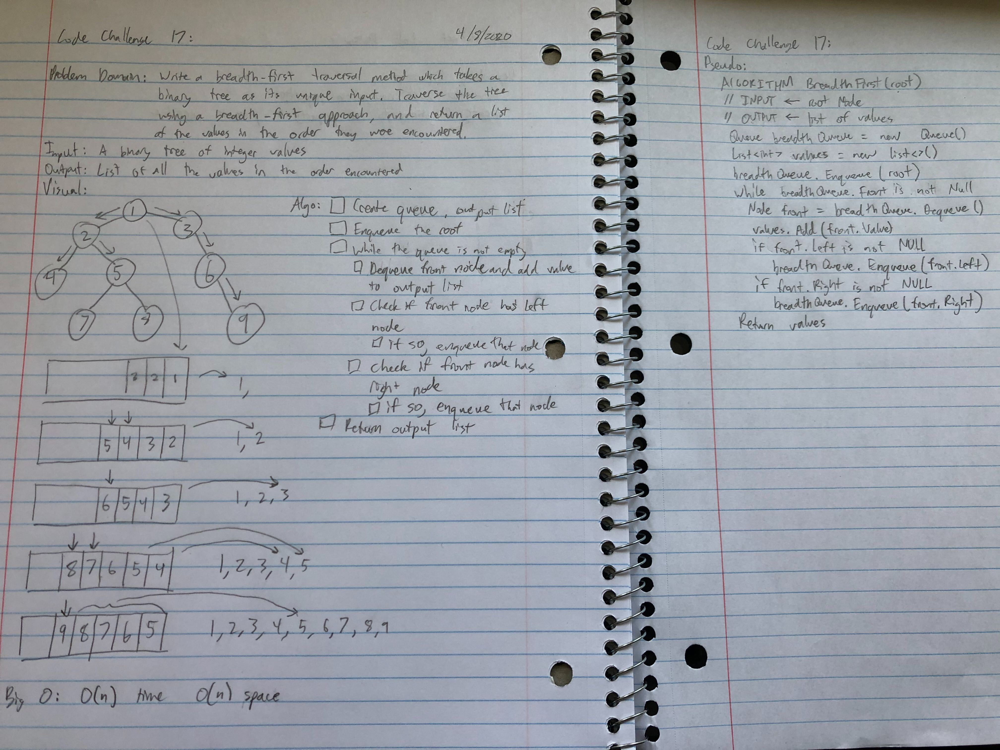
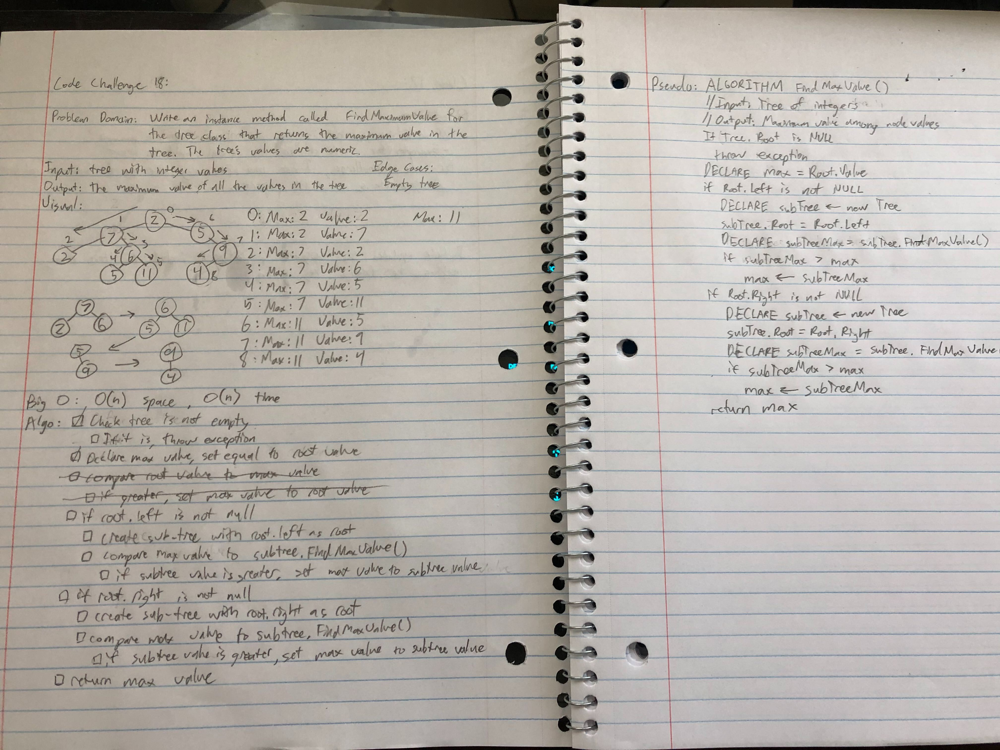

# data-structures-and-algorithms - Data Structures

## Table of Contents

### Data Structures
- Class 05 - Linked List
- Class 06 - Linked List Insertions
- Class 07 - Linked List Kth From End
- Class 08 - Linked List Merge
- Class 10 - Stacks and Queues
- Class 15 - Trees
- Class 17 - Breadth-First Tree Traversal
- Class 18 - Find Binary Tree Max Value
- Class 30 - Hash Tables
- Class 32 - Tree Intersection

## 401 Data Structures - Found in Data-Structures directory

### Code Challenge Class 05: Linked List
- Create a Node class that has properties for the value stored in the Node, and a pointer to the next Node.
- Within your LinkedList class, include a head property. Upon instantiation, an empty Linked List should be created.
- Define a method called insert which takes any value as an argument and adds a new node with that value to the head of the list with an O(1) Time performance.
- Define a method called includes which takes any value as an argument and returns a boolean result depending on whether that value exists as a Node’s value somewhere within the list.
- Define a method called toString which takes in no arguments and returns a string representing all the values in the Linked List, formatted as:
`"{ a } -> { b } -> { c } -> NULL"`
- Any exceptions or errors that come from your code should be semantic, capturable errors. For example, rather than a default error thrown by your language, your code should raise/throw a custom, semantic error that describes what went wrong in calling the methods you wrote for this lab.
- Be sure to follow your language/frameworks standard naming conventions (e.g. C# uses PascalCasing for all method and class names).

#### Approach and Efficiency
- This code has two classes, Node and LinkList. It gives Node two properties: a value and the next node in the list (which is a reference). The LinkList class has two properties which are used in its methods: Head, which references the first Node in the LinkList, and Current, which references the specific Node on which the LinkList is currently operating. LinkList has three methods which make up the bulk of its functionality. Insert creates a new node and sets that Node as the new head, making sure to first set the new Node's Next property to the old Head so that it is not cleaned up during garbage collection. Includes loops over the list while checking each Node for the given value, using that Node's Next property to iterate along the whole list. ToString also loops over the whole list, using StringBuilder to put the string together, making sure to properly append NULL to the end. All three methods have exception handling. For testing, there is one test for each method, and two for includes (testing the negative case).

#### Solution
(Whiteboarding not required for this implementation)

### Code Challenge Class 06: Linked List Insertions
- Write the following methods for the Linked List class:
  - `.append(value)` which adds a new node with the given value to the end of the list
  - `.insertBefore(value, newVal)` which add a new node with the given newValue immediately before the first value node
  - `.insertAfter(value, newVal)` which add a new node with the given newValue immediately after the first value node

#### Approach and Efficiency
- This code adds three methods: append, insertBefore, and insertAfter to the LinkedList class. 
  - The Append method loops through the whole list by getting the Next property from each node, starting at the head. Once it reaches the end of the linked list, it sets the last node's Next property as the new node, which has the new value.
    - O(n) time and O(1) space
  - The InsertBefore method is not yet finished. It currently incorrectly takes in an index, rather than a value to find.
    - O(n) time and O(1) space
  - The InsertAfter method is not yet finished.
    - O(n) time and O(1) space

#### Solution

### Code Challenge Class 07: Linked List kth From End
- Write a method for the Linked List class which takes a number, k, as a parameter. Return the node’s value that is k from the end of the linked list.
#### Approach and Efficiency
- This code adds a method getValueKthFromEnd to the LinkedList class. This method first finds the length of the linked list by traversing it and incrementing a counter on each change to the next node. Then, the method subtracts k from this value, to find the number of "nexts" required to get to the desired node. It then traverses the array, jumping the calculated number of times, and returns the value at the resulting node.
- The efficiency of this code is O(n) time because we have to traverse the list both to find the length and to get to the correct node. It is O(1) space.

#### Solution

#### References
- Reference used for testing an exception: https://stackoverflow.com/questions/45017295/assert-an-exception-using-xunit/45017575

### Code Challenge Class 08: Linked List Merge
- Write a function called mergeLists which takes two linked lists as arguments. Zip the two linked lists together into one so that the nodes alternate between the two lists and return a reference to the head of the zipped list. Try and keep additional space down to O(1).

#### Approach and Efficiency
- This code adds a method MergeLists which takes two linked lists. It then sets the current nodes of those lists to the heads to prepare for the merge. It begins a loop which will go until the end of either list is reached, and adds each value of list 2 after each value of list 1, being sure not to lose any nodes to garbage collection. When it is finished, list 2 is no longer needed, and its head is set to the head of list 1, which is now the head of the merged list. That head is returned, and both lists now reference it.
- This approach is O(n) time and O(1) space.

#### Solution

### Code Challenge Class 10: Stacks and Queues
- Create a Node class that has properties for the value stored in the Node, and a pointer to the next node.
- Create a Stack class that has a top property. It creates an empty Stack when instantiated.
  - This object should be aware of a default empty value assigned to top when the stack is created.
  - Define a method called push which takes any value as an argument and adds a new node with that value to the top of the stack with an O(1) Time performance.
  - Define a method called pop that does not take any argument, removes the node from the top of the stack, and returns the node’s value.
    - Should raise exception when called on empty stack
  - Define a method called peek that does not take an argument and returns the value of the node located on top of the stack, without removing it from the stack.
    - Should raise exception when called on empty stack
  - Define a method called isEmpty that takes no argument, and returns a boolean indicating whether or not the stack is empty.
- Create a Queue class that has a front property. It creates an empty Queue when instantiated.
  - This object should be aware of a default empty value assigned to front when the queue is created.
  - Define a method called enqueue which takes any value as an argument and adds a new node with that value to the back of the queue with an O(1) Time performance.
  - Define a method called dequeue that does not take any argument, removes the node from the front of the queue, and returns the node’s value.
    - Should raise exception when called on empty queue
  - Define a method called peek that does not take an argument and returns the value of the node located in the front of the queue, without removing it from the queue.
    - Should raise exception when called on empty queue
  - Define a method called isEmpty that takes no argument, and returns a boolean indicating whether or not the queue is empty.

#### Approach and Efficiency
- This code creates a Node class which has public properties of Value and Next, allowing other classes to manipulate these values. The class requires a value in its constructor in order to be instantiated.
  - Changing either property is just O(1) time and space

- This code creates a Stack class with a public property Top, which is a node. 
  - The Push method takes in a value, creates a node with that value, sets that node's Next property to the current top node of the Stack, and then resets the Top of the Stack to the new Node.
  - The Pop method first checks that the Stack is not empty. If it is not, it creates a local Node variable, set to the current Top node. This is the node that will be popped. The Top Node of the Stack is then changed to the next node, and then the popped Node's Next Node is set to null, to remove any connection back to the Stack. The popped Node is then returned.
  - The Peek method first checks that the Stack is not empty. If it is not, it returns the value of the Top Node.
  - The IsEmpty method returns whether the Top value of the Stack is equal to null.
  - All of the above methods take O(1) space and time.

- This code creates a Queue class with a public property Front, a Node, and a public property Rear, also a node.
  - The Enqueue method takes in a value, creates a new Node with that value, and sets the current Rear node's next property to the new Node. If the Queue is empty, it also sets the Front value to the new Node.
  - The Dequeue method first checks that the Queue is not empty. If it is not, it creates a local Node variable, set to the current Front node. This is the node that will be dequeued. The Front Node of the Stack is then changed to the next node, and them the dequeued Node's Next Node is set to null, to remove any connection back to the Stack. The dequeued Node is then returned.
  - The Peek method first checks that the Queue is not empty. If it is not, it returns the value of the Front Node.
  - The IsEmpty method returns whether the Front value of the Queue is equal to null.
  - All of the above methods take O(1) space and time.

#### Solution

### Code Challenge Class 15: Trees
- Create a Node class that has properties for the value stored in the node, the left child node, and the right child node.
- Create a BinaryTree class
  - Define a method for each of the depth first traversals called preOrder, inOrder, and postOrder which returns an array of the values, ordered appropriately.
  - Any exceptions or errors that come from your code should be semantic, capturable errors. For example, rather than a default error thrown by your language, your code should raise/throw a custom, semantic error that describes what went wrong in calling the methods you wrote for this lab.

- Create a BinarySearchTree class
  - Define a method named add that accepts a value, and adds a new node with that value in the correct location in the binary search tree.
  - Define a method named contains that accepts a value, and returns a boolean indicating whether or not the value is in the tree at least once.
#### Approach and Efficiency
- This code creates a Node class which has public properties of Value, Left, and Right. Left and Right are edges that connect to other Nodes one level down in the tree. The class requires a value in its constructor in order to be instantiated.
  - Changing either property is just O(1) time and space

- This code creates a BinaryTree class with a public property Root, which is a node. 
  - The PreOrder method takes in a root node, and returns a list of all the nodes in the tree with that root, pre-ordered (Root, Left, Right).
  - The InOrder method takes in a root node, and returns a list of all the nodes in the tree with that root,  in order (Left, Root, Right).
  - The PostOrder method takes in a root node, and returns a list of all the nodes in the tree with that root,  post-ordered (Left, Right, Root).
  - All of the above methods take O(n) space and time.

- This code creates a BinarySearchTree class with a public property Root, a Node.
  - The Add method takes in a value, creates a new Node with that value, and puts that value in the tree by comparing it to the existing values. Lesser values go left.
  - The Contains method first checks that the Queue is not empty. It returns false if that's the case. Otherwise, it navigates the tree, going left or right depending on the comparison between the current values. If it runs into a null reference, it returns false. If the value is found, the method returns true.
  - Both of the above methods take O(n) space and time.

#### Solution
(whiteboard not yet ready for submission)

### Code Challenge Class 17: Breadth-First Tree Traversal
- Write a breadth first traversal method which takes a Binary Tree as its unique input. Without utilizing any of the built-in methods available to your language, traverse the input tree using a Breadth-first approach, and return a list of the values in the tree in the order they were encountered.

#### Approach and Efficiency
- This code creates a Node class which has public properties of Value, Left, Right, and Next. Left and Right are edges that connect to other Nodes one level down in the tree. Next is used by the NodeQueue class to find the next value in the queue. The class requires a value in its constructor in order to be instantiated.
  - Changing either property is just O(1) time and space

- This code adds to the BinaryTree class with a method GetValuesBreadthFirst, which returns a list of the values retrieved after a breadth-first traversal. 
 - This method takes O(n) space and time.

#### Solution

### Code Challenge Class 18: Breadth-First Tree Traversal
- Write an instance method called find-maximum-value. Without utilizing any of the built-in methods available to your language, return the maximum value stored in the tree. You can assume that the values stored in the Binary Tree will be numeric.

#### Approach and Efficiency
- This code creates a Node class which has public properties of Value, Left, and Right. Left and Right are edges that connect to other Nodes one level down in the tree. The class requires a value in its constructor in order to be instantiated.
  - Changing either property is just O(1) time and space

- This code adds to the BinaryTree class with a method FindMaxValue, which returns the highest value in the tree after a depth-first traversal. 
 - This method takes O(n) space and time.

#### Solution

### Code Challenge Class 30: Hash Table
- Implement a Hashtable with the following methods:
  - add: takes in both the key and value. This method should hash the key, and add the key and value pair to the table, handling collisions as needed.
  - get: takes in the key and returns the value from the table.
  - contains: takes in the key and returns a boolean, indicating if the key exists in the table already.
  - hash: takes in an arbitrary key and returns an index in the collection.

#### Approach and Efficiency
- This code creates a HashTable class which has public properties of Size and Contents. Size is the length, defined at creation and modified during resizing. Contents is an array of linked lists of buckets, and defines the contents of the hash table.
- This code creates a Bucket class. 

(Full explanation not yet ready. See Whiteboards for details of HashTable.Add)

#### Solution

### Code Challenge Class 32: Tree Intersection
#### Solution
!Tree Intersection Whiteboard 1]()
