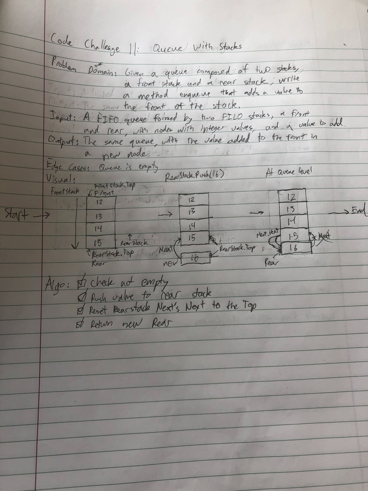
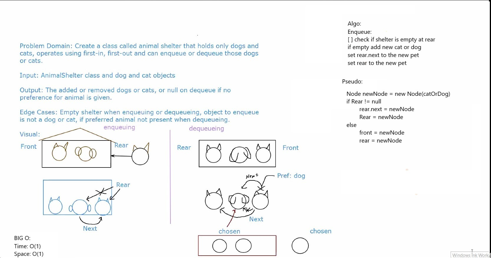
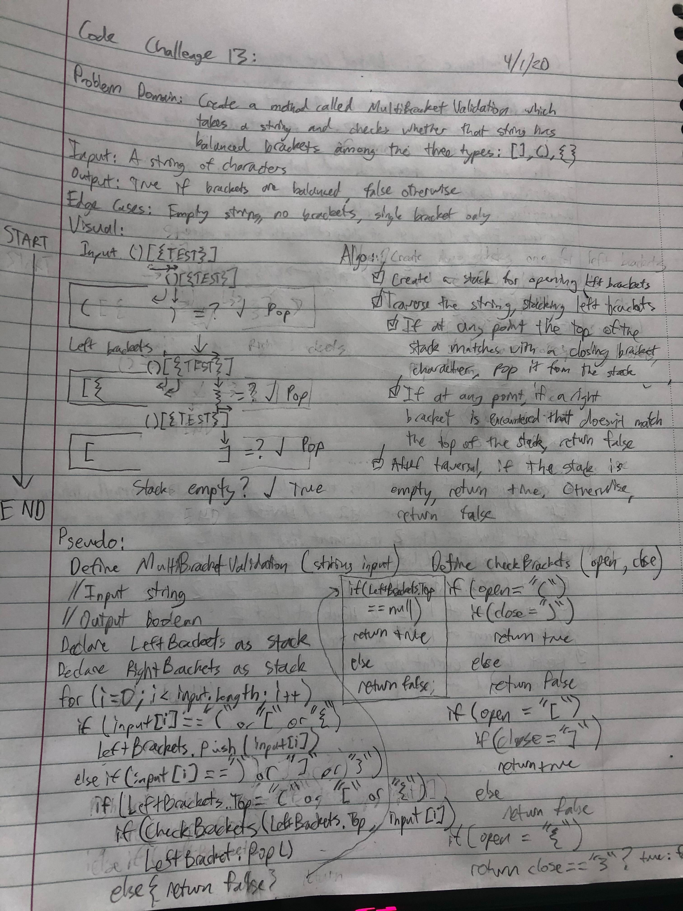
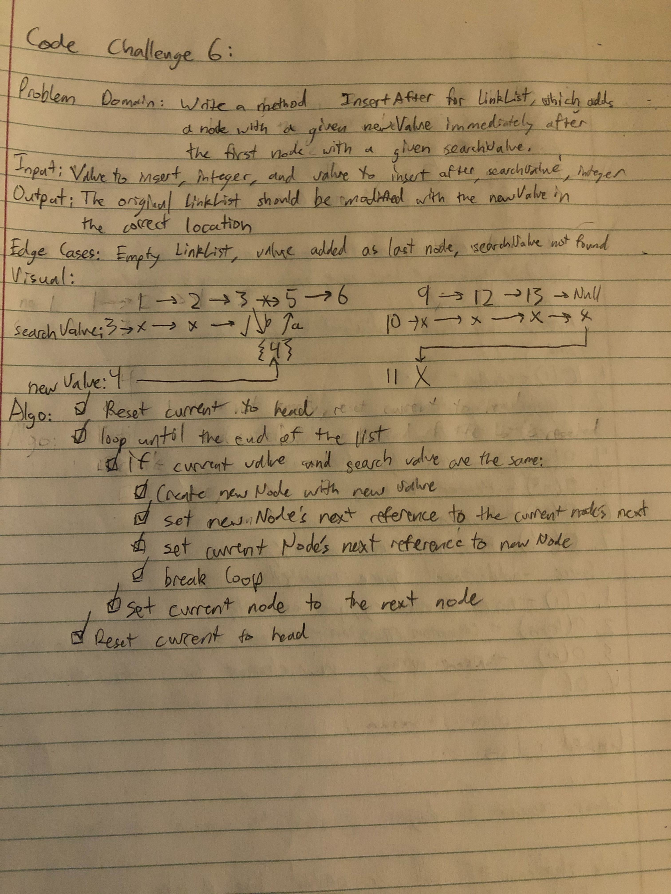

# data-structures-and-algorithms

## Table of Contents

### Challenges
- Class 01 - Array Reverse
- Class 02 - Array Shift
- Class 03 - Array Binary Search
- Class 11 - Queue with Stacks
- Class 12 - FIFO Animal Shelter
- Class 13 - Multi-Bracket Validation
- Class 16 - FizzBuzzTree

### Data Structures
- Class 05 - Linked List
- Class 06 - Linked List Insertions
- Class 07 - Linked List Kth From End
- Class 08 - Linked List Merge
- Class 10 - Stacks and Queues
- Class 15 - Trees
- Class 16 - Breadth-First Tree Traversal

## 401 Code Challenges - Found in challenges directory

### Code Challenge Class 01: Array Reverse
- Write a function called reverseArray which takes an array as an argument. Without utilizing any of the built-in methods available to your language, return an array with elements in reversed order.

#### Approach and Efficiency
- This code uses a for loop to iterate over the new array, and set its index values in ascending order. It sets these values equal to the input array's index values in descending order.
- The big O is O(n) time

#### Solution

### Code Challenge Class 02: Array Shift
- Write a function called insertShiftArray which takes in an array and the value to be added. Without utilizing any of the built-in methods available to your language, return an array with the new value added at the middle index.

#### Approach and Efficiency
- This code creates a new array with a length one longer than the current array. It then finds the value of the middle index of the new array based on its length. The method then loops over the new array, and for indexes less than the middle index, enters the values at those indexes from the current array. At the middle index, it enters the new value. At indexes greater than the middle index, it enters the values from the current array at the new array index - 1.
- The big O is O(n) time

#### Solution

### Code Challenge Class 03: Array Binary Search
- Write a function called BinarySearch which takes in 2 parameters: a sorted array and the search key. Without utilizing any of the built-in methods available to your language, return the index of the array’s element that is equal to the search key, or -1 if the element does not exist.

#### Approach and Efficiency
- This code takes the given array and first sets upper and lower limits equal to the array's highest and lowest indexes of 0 and it's length -1. It also initializes a middle index. It enters a loop, which will run as long as the lower limit is less than or equal to the upper limit. The middle index now gets set as the index in the middle of the two limits. The code compares the value at the middle index to the key. If the value is less than the key, it moves the lower limit to the middle index + 1, since we know the key cannot be at lower index. If the value is more than the key, it moves the upper limit to the middle index - 1, since we know the key cannot be at a higher index. If the value is equal to the key, we return the middle index, because we have found our value. If the lower and upper limits are the same and the value is not at that index, the whole array has been searched, the loop is exited, and -1 is returned.
- The big O is O(log n) time O(1) space

#### Solution

### Code Challenge Class 11: Queue with Stacks
- Create a brand new PseudoQueue class. Do not use an existing Queue. Instead, this PseudoQueue class will implement our standard queue interface (the two methods listed below), but will internally only utilize 2 Stack objects. Ensure that you create your class with the following methods:
  - enqueue(value) which inserts value into the PseudoQueue, using a first-in, first-out approach.
  - dequeue() which extracts a value from the PseudoQueue, using a first-in, first-out approach.
- The Stack instances have only push, pop, and peek methods. You should use your own Stack implementation. Instantiate these Stack objects in your PseudoQueue constructor.

#### Approach and Efficiency
- This code uses the stack methods to achieve the queue methods.
- The big O is O(1) time O(1) space

#### Solution

### Code Challenge Class 12: FIFO Animal Shelter
- Create a class called AnimalShelter which holds only dogs and cats. The shelter operates using a first-in, first-out approach.
  - Implement the following methods:
    - enqueue(animal): adds animal to the shelter. animal can be either a dog or a cat object.
    - dequeue(pref): returns either a dog or a cat. If pref is not "dog" or "cat" then return null.

#### Approach and Efficiency
- This code uses variations of the enqueue and dequeue methods we've used previously for our queue data structure.
  - The code has an Animal object with a species (cat or dog), and a name (for better testing, to distinguish between multiples of the same species). It has a Next property to link to the next animal in line at the shelter.
  - For the Enqueue method, we take in an Animal object, check whether the shelter is empty, and if it is, set the Front and Rear properties of the shelter to the new Animal. If not, then we set the next animal of the animal currently last in line to the new animal, and then set the new animal to the new last in line.
    - The big O of Enqueue is O(1) time O(1) space.
  - For the Dequeue method, we take a preference of species (cat or dog), and check whether the shelter is empty, throwing an exception if it is. If not, we go through the animals in line, starting at the front, and check whether their species matches the preferred species. If a match is found, we set the match as the chosen animal and check whether the animal is first in line. If it is, we set the next animal as the new animal at the front of the line. If not, we track the previous animal and set that animal to skip the chosen animal in line by setting its next value to the animal after the current. Either way, we reset the chosen animal's next animal to null, to fully remove the connection to the line. We then return the animal. If a match is not found, we continue to iterate through the line until a match is found or we reach the end. If we reach the end with no match to the preference, we return null.
    - The big O of Dequeue is O(n) time and O(1) space.

#### Solution

### Code Challenge Class 13: Multi-Bracket Validation
- Your function should take a string as its only argument, and should return a boolean representing whether or not the brackets in the string are balanced. There are 3 types of brackets:
  - Round Brackets : ()
  - Square Brackets : []
  - Curly Brackets : {}

#### Approach and Efficiency
- This code travereses through the input string, looking for brackets. It utilizes a stack data structure with Nodes to track opening brackets and pops those brackets from the top of the stack only when a corresponding closing bracket is correctly found. The code will return false immediately upon encountering a closing bracket that does not have a corresponding opening bracket. After reaching the end of the string, the code checks whether the stack is empty. If it isn't, that means that there are unclosed brackets, and the method returns false. Otherwise, it returns true, because it has determined that the string is balanced.
  - The Stack data structure has methods Push() and Pop(), both of which are O(1) space and time.
  - The main method MultiBracketValidation has a big O of O(n) space and O(n) time.

#### Solution

### Code Challenge Class 16: FizzBuzz Tree
- Write a function called FizzBuzzTree which takes a tree as an argument.
- Without utilizing any of the built-in methods available to your language, determine whether or not the value of each node is divisible by 3, 5 or both. Create a new tree with the same structure as the original, but the values modified as follows:
  - If the value is divisible by 3, replace the value with “Fizz”
  - If the value is divisible by 5, replace the value with “Buzz”
  - If the value is divisible by 3 and 5, replace the value with “FizzBuzz”
  - If the value is not divisible by 3 or 5, simply turn the number into a String.
- Return the new tree.

#### Approach and Efficiency
- This code travereses through the given tree, checking each value against the fizzbuzz rules. It utilizes the tree data structure with Nodes and sub-trees to perform recursively in a pre-ordered traversal. 
  - The Node class has properties for Value, which is type Object to allow both string and integer values, and Left and Right which reference the connected sub-nodes.
  - The Tree class has properties of Root, a Node, and SubTree, a Tree.
  - The main function FizzBuzzTree takes in a tree, and traverses through in a pre-ordered traversal, first checking the root value and modifying it according to FizzBuzz. It then checks whether there are left and right nodes for the root, and runs itself recursively on new subtrees that have the left and right nodes as their roots. The left trees are first, the right trees after.
    - The function operates with O(n) time and O(n) space, because it creates a new sub-tree for each node in the tree.

#### Solution

## 401 Data Structures - Found in Data-Structures directory

### Code Challenge Class 05: Linked List
- Create a Node class that has properties for the value stored in the Node, and a pointer to the next Node.
- Within your LinkedList class, include a head property. Upon instantiation, an empty Linked List should be created.
- Define a method called insert which takes any value as an argument and adds a new node with that value to the head of the list with an O(1) Time performance.
- Define a method called includes which takes any value as an argument and returns a boolean result depending on whether that value exists as a Node’s value somewhere within the list.
- Define a method called toString which takes in no arguments and returns a string representing all the values in the Linked List, formatted as:
`"{ a } -> { b } -> { c } -> NULL"`
- Any exceptions or errors that come from your code should be semantic, capturable errors. For example, rather than a default error thrown by your language, your code should raise/throw a custom, semantic error that describes what went wrong in calling the methods you wrote for this lab.
- Be sure to follow your language/frameworks standard naming conventions (e.g. C# uses PascalCasing for all method and class names).

#### Approach and Efficiency
- This code has two classes, Node and LinkList. It gives Node two properties: a value and the next node in the list (which is a reference). The LinkList class has two properties which are used in its methods: Head, which references the first Node in the LinkList, and Current, which references the specific Node on which the LinkList is currently operating. LinkList has three methods which make up the bulk of its functionality. Insert creates a new node and sets that Node as the new head, making sure to first set the new Node's Next property to the old Head so that it is not cleaned up during garbage collection. Includes loops over the list while checking each Node for the given value, using that Node's Next property to iterate along the whole list. ToString also loops over the whole list, using StringBuilder to put the string together, making sure to properly append NULL to the end. All three methods have exception handling. For testing, there is one test for each method, and two for includes (testing the negative case).

#### Solution
(Whiteboarding not required for this implementation)

### Code Challenge Class 06: Linked List Insertions
- Write the following methods for the Linked List class:
  - `.append(value)` which adds a new node with the given value to the end of the list
  - `.insertBefore(value, newVal)` which add a new node with the given newValue immediately before the first value node
  - `.insertAfter(value, newVal)` which add a new node with the given newValue immediately after the first value node

#### Approach and Efficiency
- This code adds three methods: append, insertBefore, and insertAfter to the LinkedList class. 
  - The Append method loops through the whole list by getting the Next property from each node, starting at the head. Once it reaches the end of the linked list, it sets the last node's Next property as the new node, which has the new value.
    - O(n) time and O(1) space
  - The InsertBefore method is not yet finished. It currently incorrectly takes in an index, rather than a value to find.
    - O(n) time and O(1) space
  - The InsertAfter method is not yet finished.
    - O(n) time and O(1) space

#### Solution

### Code Challenge Class 07: Linked List kth From End
- Write a method for the Linked List class which takes a number, k, as a parameter. Return the node’s value that is k from the end of the linked list.
#### Approach and Efficiency
- This code adds a method getValueKthFromEnd to the LinkedList class. This method first finds the length of the linked list by traversing it and incrementing a counter on each change to the next node. Then, the method subtracts k from this value, to find the number of "nexts" required to get to the desired node. It then traverses the array, jumping the calculated number of times, and returns the value at the resulting node.
- The efficiency of this code is O(n) time because we have to traverse the list both to find the length and to get to the correct node. It is O(1) space.

#### Solution

#### References
- Reference used for testing an exception: https://stackoverflow.com/questions/45017295/assert-an-exception-using-xunit/45017575

### Code Challenge Class 08: Linked List Merge
- Write a function called mergeLists which takes two linked lists as arguments. Zip the two linked lists together into one so that the nodes alternate between the two lists and return a reference to the head of the zipped list. Try and keep additional space down to O(1).

#### Approach and Efficiency
- This code adds a method MergeLists which takes two linked lists. It then sets the current nodes of those lists to the heads to prepare for the merge. It begins a loop which will go until the end of either list is reached, and adds each value of list 2 after each value of list 1, being sure not to lose any nodes to garbage collection. When it is finished, list 2 is no longer needed, and its head is set to the head of list 1, which is now the head of the merged list. That head is returned, and both lists now reference it.
- This approach is O(n) time and O(1) space.

#### Solution

### Code Challenge Class 10: Stacks and Queues
- Create a Node class that has properties for the value stored in the Node, and a pointer to the next node.
- Create a Stack class that has a top property. It creates an empty Stack when instantiated.
  - This object should be aware of a default empty value assigned to top when the stack is created.
  - Define a method called push which takes any value as an argument and adds a new node with that value to the top of the stack with an O(1) Time performance.
  - Define a method called pop that does not take any argument, removes the node from the top of the stack, and returns the node’s value.
    - Should raise exception when called on empty stack
  - Define a method called peek that does not take an argument and returns the value of the node located on top of the stack, without removing it from the stack.
    - Should raise exception when called on empty stack
  - Define a method called isEmpty that takes no argument, and returns a boolean indicating whether or not the stack is empty.
- Create a Queue class that has a front property. It creates an empty Queue when instantiated.
  - This object should be aware of a default empty value assigned to front when the queue is created.
  - Define a method called enqueue which takes any value as an argument and adds a new node with that value to the back of the queue with an O(1) Time performance.
  - Define a method called dequeue that does not take any argument, removes the node from the front of the queue, and returns the node’s value.
    - Should raise exception when called on empty queue
  - Define a method called peek that does not take an argument and returns the value of the node located in the front of the queue, without removing it from the queue.
    - Should raise exception when called on empty queue
  - Define a method called isEmpty that takes no argument, and returns a boolean indicating whether or not the queue is empty.

#### Approach and Efficiency
- This code creates a Node class which has public properties of Value and Next, allowing other classes to manipulate these values. The class requires a value in its constructor in order to be instantiated.
  - Changing either property is just O(1) time and space

- This code creates a Stack class with a public property Top, which is a node. 
  - The Push method takes in a value, creates a node with that value, sets that node's Next property to the current top node of the Stack, and then resets the Top of the Stack to the new Node.
  - The Pop method first checks that the Stack is not empty. If it is not, it creates a local Node variable, set to the current Top node. This is the node that will be popped. The Top Node of the Stack is then changed to the next node, and then the popped Node's Next Node is set to null, to remove any connection back to the Stack. The popped Node is then returned.
  - The Peek method first checks that the Stack is not empty. If it is not, it returns the value of the Top Node.
  - The IsEmpty method returns whether the Top value of the Stack is equal to null.
  - All of the above methods take O(1) space and time.

- This code creates a Queue class with a public property Front, a Node, and a public property Rear, also a node.
  - The Enqueue method takes in a value, creates a new Node with that value, and sets the current Rear node's next property to the new Node. If the Queue is empty, it also sets the Front value to the new Node.
  - The Dequeue method first checks that the Queue is not empty. If it is not, it creates a local Node variable, set to the current Front node. This is the node that will be dequeued. The Front Node of the Stack is then changed to the next node, and them the dequeued Node's Next Node is set to null, to remove any connection back to the Stack. The dequeued Node is then returned.
  - The Peek method first checks that the Queue is not empty. If it is not, it returns the value of the Front Node.
  - The IsEmpty method returns whether the Front value of the Queue is equal to null.
  - All of the above methods take O(1) space and time.

#### Solution

### Code Challenge Class 15: Trees
- Create a Node class that has properties for the value stored in the node, the left child node, and the right child node.
- Create a BinaryTree class
  - Define a method for each of the depth first traversals called preOrder, inOrder, and postOrder which returns an array of the values, ordered appropriately.
  - Any exceptions or errors that come from your code should be semantic, capturable errors. For example, rather than a default error thrown by your language, your code should raise/throw a custom, semantic error that describes what went wrong in calling the methods you wrote for this lab.

- Create a BinarySearchTree class
  - Define a method named add that accepts a value, and adds a new node with that value in the correct location in the binary search tree.
  - Define a method named contains that accepts a value, and returns a boolean indicating whether or not the value is in the tree at least once.
#### Approach and Efficiency
- This code creates a Node class which has public properties of Value, Left, and Right. Left and Right are edges that connect to other Nodes one level down in the tree. The class requires a value in its constructor in order to be instantiated.
  - Changing either property is just O(1) time and space

- This code creates a BinaryTree class with a public property Root, which is a node. 
  - The PreOrder method takes in a root node, and returns a list of all the nodes in the tree with that root, pre-ordered (Root, Left, Right).
  - The InOrder method takes in a root node, and returns a list of all the nodes in the tree with that root,  in order (Left, Root, Right).
  - The PostOrder method takes in a root node, and returns a list of all the nodes in the tree with that root,  post-ordered (Left, Right, Root).
  - All of the above methods take O(n) space and time.

- This code creates a BinarySearchTree class with a public property Root, a Node.
  - The Add method takes in a value, creates a new Node with that value, and puts that value in the tree by comparing it to the existing values. Lesser values go left.
  - The Contains method first checks that the Queue is not empty. It returns false if that's the case. Otherwise, it navigates the tree, going left or right depending on the comparison between the current values. If it runs into a null reference, it returns false. If the value is found, the method returns true.
  - Both of the above methods take O(n) space and time.

#### Solution
(whiteboard not yet ready for submission)

